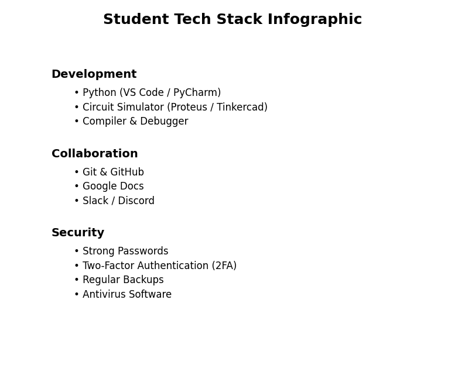

# Ditital Literacy
# My Daily Tech Stack 💻🛡️

Hey everyone! 👋 This repo holds my infographic project where I mapped out the digital tools and security habits I actually use day-to-day as a tech student. 

*(Note to self: Upload the Canva PNG file to this repository and name it `tech_stack_infographic.png` so the image shows up right here!)*

I wanted to visualize the software that helps me get my assignments done, keep my code safe, and survive group projects without losing my mind. I used Canva for the design because their tech templates are super clean and easy to tweak.

## 🛠️ What's Inside?

I broke my digital toolset down into three main areas:

* **Development:** The heavy lifters. This includes VS Code, my Python/Jupyter setup for ML stuff, and the circuit simulators we use for hardware labs.
* **Collaboration:** How we handle group work. Mainly GitHub for version control (and avoiding the "final_final_v2_real.zip" mess), plus Discord/Teams for coordination.
* **Security & Safe Practices:** The boring-but-crucial stuff. I highlighted setting up Two-Factor Authentication (2FA) for cloud services and GitHub, plus using a solid password manager so I don't get locked out of my accounts right before a deadline.

## 📁 Files in this repository

* `README.md` - You're reading it right now!
* `tech_stack_infographic.pdf` - The high-res export from Canva.
* `tech_stack_infographic.png` - The preview image displayed above.

## 💡 Reflection

This was a pretty fun assignment to put together. It honestly made me realize how much I rely on cloud tools and why locking them down with 2FA is a lifesaver. Next time, I might expand it to include the productivity and time-management apps that keep me sane during exam season, but I wanted to keep this one focused strictly on dev tools and security first.
